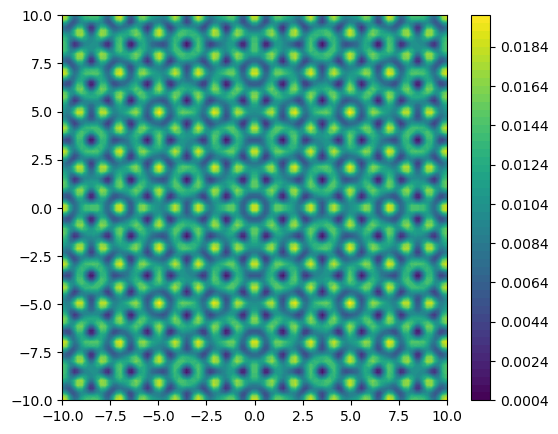
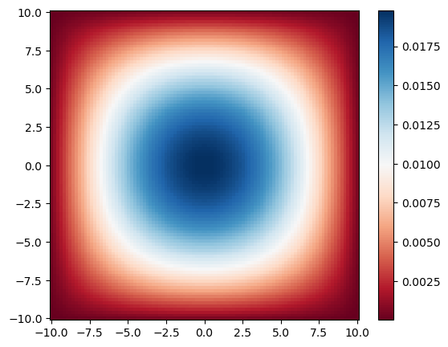
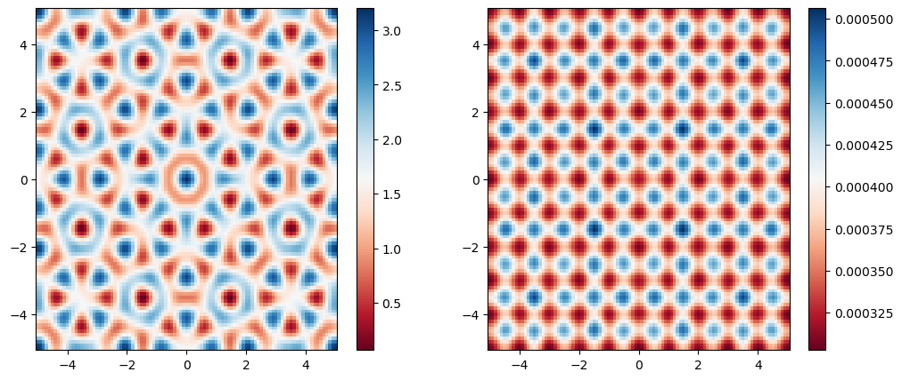

The text and method is based on the following sources:

* Youtube, *[2D Schrodinger Equation Numerical Solution in PYTHON](https://youtu.be/DF1SnjXZcbM)*, (2022), Available at: (Accessed: 6 March 2022).
* Alexvas, *[Discretization of Laplacian with boundary conditions](https://scicomp.stackexchange.com/q/25976)*, (2017), Available at: (Accessed: 6 March 2022).
* Thomas H. Pulliam, David W. Zingg., *Fundamental Algorithms in Computational Fluid Dynamics*, (2014), Springer.

```julia
using PyPlot, PyCall
using LinearAlgebra
using SparseArrays
using Arpack, KrylovKit
```

## Two-dimensional box

The goal is to solve the single particle Schrödinger equation in a two-dimensional box of length $2L$ of the Hamiltonian:
$$
    \hat{h}=\frac{-\hbar^{2}}{2 m} \nabla^{2}+V(\mathbf{r}, t).
$$
The box can have a homogeneous Dirichlet boundary condition, i.e., the wave function evaluated at the border must vanish, or periodic boundary conditions. There can be a potential $V$ in the box. So let us a meshgrid of $\mathbf{x}$ and $\mathbf{y}$ coordinates.

```julia
N = 100
L = 10.0
Δx² = (2*L/N)^2
function meshgrid(x, y)
    X = [x for _ in y, x in x]
    Y = [y for y in y, _ in x]
    X, Y
end
x = LinRange(-L, L, N)
y = LinRange(-L, L, N)
X, Y = meshgrid(x, y);
```

## Potential

The potential is chosen to be eightfold rotation symmetric quasicrystal, centered on $\mathbf{r}=0,$
$$
    V(\mathbf{r})=V_{0} \sum_{k=1}^{4} \cos ^{2} \left(\mathbf{G}^k \cdot \mathbf{r}\right),
$$
where $V_{0}$ is the potential amplitude and the quantities $G^{k}$ are the lattice vectors of four mutually incoherent standing waves oriented at the angles $0^{\circ}, 45^{\circ}, 90^{\circ}$, and $135^{\circ}$, respectively. The lattice vectors have norm $\left|G^{k}\right|=\pi / a$.

```julia
function get_potential(x, y, V₀)
    return V₀*(cos(pi*x)^2 + cos(pi*√2/2*(x+y))^2 + cos(pi*y)^2 + cos(-pi/(√2)*(x-y))^2)
end

V = get_potential.(X,Y, 0.005)
fig = figure(figsize=(6.2,5))
contourf(X, Y, V, 50)
colorbar()
```



## Units

The Schrödinger equation is given by
$$ \left[\frac{-\hbar^{2}}{2 m} \nabla^{2}+V(\mathbf{r})\right] \psi(\mathbf{r}) = E\psi(\mathbf{r}),$$
Let us use the lattice spacing $a$ and the corresponding recoil energy $E_r = \pi^2\hbar^2/2ma^2$ as the space and energy units, respectively, such that we have

$$
\left[\frac{-\hbar^2}{2 m E_ra^2} \tilde{\nabla}^{2}+\frac{V(\mathbf{\tilde{r}})}{E_r}\right] \psi(\mathbf{\tilde{r}})
= \left[
  \frac{-1}{\pi^2} \tilde{\nabla}^{2}+\tilde{V}_{0} \sum^4_k \cos^{2}\left(\tilde{\mathbf{G}}^{k} \cdot \tilde{\mathbf{r}}\right)
\right]
\psi(\mathbf{\tilde{r}})
= \tilde{E}\psi(\mathbf{\tilde{r}}),
$$

where $|\tilde{\mathbf{G}}_{k}|=\pi$, $\tilde{\mathbf{r}} = \frac{\mathbf{r}}{a}$, and $\tilde{E}=\frac{E}{E_r}$.

## Discretize in one dimension

Rest us to discretize our Hamiltonian. The idea can be easily explained by the following **finite difference approximation** of the second derivative in one dimension
$$ \frac{d^2 \psi}{dx^2} \approx \frac{\psi_{i+1}-2\psi_i + \psi_{i-1}}{\Delta x^2}.$$

### Dirichlet boundary conditions

Suppose we have $M=4$ interior points and $a$ and $b$ two boundary points, a mesh with four interior points $\Delta x=2L /(M+1)$, represented as follows
$$
\begin{aligned}
    &\qquad \ \ \ \ a \ \ \  1  \ \ \ 2 \ \ \ 3 \ \ \  4 \ \ \  b \\\\\\
    &x=- \ L \ - \ - \ - \ - \ \ L
\end{aligned}
$$
We impose Dirichlet boundary conditions, $u(-L)=u_{a}, u(L)=u_{b}$ and use the **centered finite difference approximation** at every point in the mesh. We arrive at the four equations:

$$
\left(d_{x x} u\right)_{1} =\frac{1}{\Delta x^{2}} (u_a - 2 u_1 + u_2)
$$

$$
\left(d_{x x} u\right)_{2} =\frac{1}{\Delta x^{2}} (u_1-2 u_2+u_3)
$$

$$
\left(d_{x x} u\right)_{2} =\frac{1}{\Delta x^{2}} (u_2-2 u_3+u_4)
$$

$$
\left(d_{x x} u\right)_{4} =\frac{1}{\Delta x^{2}}\left(u_3-2 u_4+u_b\right)
$$

Introducing
$$
\begin{aligned}
\vec{u}=\left( \begin{array}{c} \psi_{1} \\\\\\ \psi_{2} \\\\\\ \psi_{3} \\\\\\ \psi_{4} \end{array} \right)
\quad
(\overrightarrow{b c})=\frac{1}{\Delta x^{2}} \left( \begin{array}{c} \psi_{a} \\\\\\ 0 \\\\\\ 0 \\\\\\ \psi_{b} \end{array} \right)
\quad
A=\frac{1}{\Delta x^{2}} \left( \begin{array}{rrrr} -2 & 1 & & \\\\\\ 1 & -2 & 1 & \\\\\\ & 1 & -2 & 1 \\\\\\ & & 1 & -2 \end{array} \right)
\end{aligned}
$$
we can rewrite in matrix form as
$$
\begin{aligned}
\frac{d^2 \psi}{dx^2} =\frac{1}{\Delta x^{2}}D= A \vec{\psi}+(\overrightarrow{b c})
\end{aligned}
$$

### Periodic boundary conditions

> This subsection has to be tested and worked out. First try did not work.

Suppose we have $M=8$ points on a linear **periodic** mesh, represented as follows
$$
\begin{aligned}
    &\cdots \ \ \ 7 \ \ \ \  8 \ \ \ \ \ \ a \ \ \ \ 1 \ \ \ \ 2 \ \ \ \ 3 \ \ \ \ 4 \ \ \ \ b \ \ \ \ 1 \ \ \ \ 2 \ \ \ \cdots \\\\\\
    &x= \ - \ \ - \ \ -L \ \ - \ \ - \ \ - \ \ - \ \ L \ \ - \ \ -
\end{aligned}
$$
where we have that $\psi(L)=\psi(-L)$. It can be shown that the matrix representation is modified by
$$
\begin{aligned}
     \frac{d^2 \psi}{dx^2} =\frac{1}{\Delta x^{2}}D_p=\frac{1}{\Delta x^{2}} \left( \begin{array}{rrrr} -2 & 1 & & 1 \\\\\\ 1 & -2 & 1 & \\\\\\ & 1 & -2 & 1 \\\\\\ 1 & & 1 & -2 \end{array} \right)
\end{aligned}
$$


## Discretize in two dimensions

In **two dimensions**, the wavefunction is not a vector anymore but a matrix. However, we would like to write it back as vector via the transformation
$$
    \left( \begin{array}{rrrr} \psi_{11} & \psi_{12} & \cdots & \psi_{1N} \\\\\\ \psi_{21} & \psi_{22} & \cdots & \psi_{2N} \\\\\\ \vdots & \vdots & \ddots & \vdots \\\\\\ \psi_{N1} & \psi_{N2} & \cdots & \psi_{NN} \end{array} \right) \rightarrow \left( \begin{array}{c} \psi_{11} \\\\\\ \psi_{12} \\\\\\ \vdots \\\\\\  \psi_{NN} \end{array} \right)
$$
The second derivative finite difference matrix must than be written as
$$
    \frac{\partial^2 \psi}{\partial x^2} = \frac{1}{\Delta x^{2}} I \otimes D = \frac{1}{\Delta x^{2}} \left( \begin{array}{rrr} D &  & \\\\\\  & \ddots & \\\\\\ &  & D\end{array} \right)
$$
where $\otimes$ is the **Kronecker product**. The **2D Laplacian** can than be written as
$$
    \nabla^{2} = \frac{\partial^2 \psi}{\partial x^2} + \frac{\partial^2 \psi}{\partial y^2} = \frac{1}{\Delta x^{2}} (I \otimes D + D \otimes I) = \frac{1}{\Delta x^{2}} D\oplus D
$$
where $\oplus$ is the **Kronecker sum**, and we used that we discretized space as a **squared grid**, i.e. $\Delta x^{2}=\Delta y^{2}$.

## Hamiltonian

Let us assume the homogeneous Dirichlet Boundary conditions $\psi(L, y) = \psi(-L, y) = \psi(x, L) = \psi(x, -L) = 0$. The **discretized Schrödinger equation** can then be written as
$$
\left[-\frac{1}{\pi^2}(D \oplus D) + \Delta x^2 \tilde{V} \right] \psi = \left( \Delta x^2 \tilde{E}\right) \psi,
$$
where $D$ has -2 on the main diagonal and 1 on the two neighboring diagonals and $\psi$ is a vector. One could define the potential in units of $\Delta x^2$; in other words `get_potential` actually returns $\Delta x^2 V$. However, we will leave $\Delta x^2$ in the kinetic term.
Now we construct
$$
\hat{h} = -\frac{1}{\Delta x^{2}\pi^2} D \oplus D +  \tilde{V}
$$
such that the corresponding eigenvalues $\tilde{E}$ are in units of recoil energy $E_r$.
Let $T=-\frac{1}{\Delta x^{2}\pi^2} D \oplus D$ and $U = V$

```julia
diag = ones(N); # vector of ones
diags = Vector([diag[begin:end-1], -2*diag, diag[begin:end-1]]); # vector of vectors of the diagonals
D = sparse(Tridiagonal(diags...)) # creates the discretised 2nd derivative
T = -1/(Δx²*pi^2) * (kron(D, sparse(I,N,N)) + kron(sparse(I,N,N), D))  #N**2 x N**2 matrix
U = spdiagm(reshape(V, N^2))
H = T+U;
```

Here we used the package `SparseArrays.jl` to make the computations faster. **Sparse arrays** are arrays that contain enough zeros that storing them in a special data structure leads to savings in space and execution time, compared to dense arrays.

## Eigenvectors and eigenvalues

Now that we constructed our discretized Hamiltonian we can just exactly diagonalize our Hamiltonian to find the **eigenvalues** and **eigenvector**. We shall to this with the package `Arpack.jl` which is a *Julia* wrapper to a *FORTRAN 77* library designed to compute a few eigenvalues and corresponding eigenvectors of large sparse or structured matrices, using the **Implicitly Restarted Arnoldi Method** (IRAM) or, in the case of symmetric matrices, the corresponding variant of the **Lanczos algorithm**. Both are classified as *Krylov subspace based algorithms* (see wikipedia). It is used by many popular numerical computing environments such as *SciPy*, *Mathematica*, *GNU Octave* and *MATLAB* to provide this functionality.

We use the `eigs` function where `nev` specifies how many eigenvalues and eigenvectors we want and `which` specifies the type of eigenvalues to compute. For my purposes I only need the ground state wave function.

Alternatively, one could use `KrylovKit.jl`, a native Julia package collecting a number of Krylov-based algorithms for linear problems, singular value and eigenvalue problems and the application of functions of linear maps or operators to vectors. With `KrylovKit.jl` I manage to find better results if when I increase the number of point $N$. My theory is that it, as black box solver, uses another method above a certain threshold $N^*$, whereas `Arpack.jl` sticks to the same method and hence gives worse results.

```julia
# eigenvalues, eigenvectors = eigs(H, nev=1, which=:SM);
_, vecs, _ = eigsolve(H, 1, :SR);
# vecs[1]
```

As we constructed the Hamiltonian to be a $N^2 \times N^2$ so that $\psi$ could be a vector, we have to reshape the eigenvectors back to a $N \times N$ matrix.

```julia
function get_e(n::Int64)
    return reshape(vecs[1]', N, N)
end;
```

```julia
figure(figsize=(6.2,5))
pcolormesh(X, Y, get_e(0)^2, cmap=:RdBu)
colorbar()
# contourf(X, Y, get_e(0)^2, 100)
```



## Summary

```julia
using PyPlot, PyCall
using LinearAlgebra
using SparseArrays
using Arpack, KrylovKit

function meshgrid(x::LinRange{Float64, Int64}, y::LinRange{Float64, Int64})::Tuple{Matrix{Float64}, Matrix{Float64}}
    X = [x for _ in y, x in x]
    Y = [y for y in y, _ in x]
    X, Y
end
function QC(x::Float64, y::Float64, V₀::Float64)::Float64
    return V₀*(cos(pi*x)^2 + cos(pi*√2/2*(x+y))^2 + cos(pi*y)^2 + cos(-pi/(√2)*(x-y))^2)
end
function free(x::Float64, y::Float64, V₀::Float64)::Float64
    return V₀*(0*x+0*y)
end
function PC(x::Float64, y::Float64, V₀::Float64)::Float64
    return V₀*(sin(pi*x)^2+sin(pi*y)^2)
end
function eigenfunctionDBCArpack(V::Matrix{Float64}, L::Float64, N::Int64)
    Δx² = (2*L/N)^2
    # creates the discretised 2nd derivative
    D = sparse(Tridiagonal(ones(N-1), -2*ones(N), ones(N-1)))
    # N**2 x N**2 matrix
    T = -1/(Δx²*pi^2) * (kron(D, sparse(I,N,N)) + kron(sparse(I,N,N), D))
    U = spdiagm(reshape(V, N^2))
    H = T + U;

    _, eigenvector = eigs(H, nev=1, which=:SM);

    return reshape(eigenvector', N, N)
end
function eigenfunctionDBCKrylov(V::Matrix{Float64}, L::Float64, N::Int64)
    Δx² = (2*L/N)^2
    # creates the discretised 2nd derivative
    D = sparse(Tridiagonal(ones(N-1), -2*ones(N), ones(N-1)))
    # N**2 x N**2 matrix
    T = -1/(Δx²*pi^2) * (kron(D, sparse(I,N,N)) + kron(sparse(I,N,N), D))
    U = spdiagm(reshape(V, N^2))
    H = T + U;

    _, vecs, _ = eigsolve(H, 1,:SR)
    # _, eigenvector = eigs(H, nev=1, which=:SM);

    return reshape(vecs[1]', N, N)
end
# function eigenfunctionPBC(V::Matrix{Float64})
    # Δx² = (2*L/N)^2
    # # creates the discretised 2nd derivative
    # D = sparse(Tridiagonal(ones(N-1), -2*ones(N), ones(N-1)))
    # D[1, end] = 1.0
    # D[end, 1] = 1.0
    # # N**2 x N**2 matrix
    # T = -1/(Δx²*pi^2) * (kron(D, sparse(I,N,N)) + kron(sparse(I,N,N), D))
    # U = spdiagm(reshape(V, N^2))
    # H = T + U;
    # N = size(V)[1]
    # # creates the discretised 2nd derivative
    # D = sparse(Tridiagonal(ones(N-1), -2*ones(N), ones(N-1)))

    # _, eigenvector = eigs(H, nev=1, which=:SM);

#     return reshape(eigenvector', N, N)
# end
```

```julia
V₀ = 0.8
L = 50.0
Δx² = 0.1
N = Int64(div(2L, Δx²))

X, Y = meshgrid(LinRange(-L, L, N), LinRange(-L, L, N));
V = QC.(X, Y, V₀)
ef = eigenfunctionDBCKrylov(V, L, N)

fig, axes = subplots(nrows=1, ncols=2, figsize=(12, 5))
im1 = axes[1].pcolormesh(X[450:550,450:550], Y[450:550,450:550], V[450:550,450:550], cmap=:RdBu)
colorbar(im1, ax=axes[1])
im2 = axes[2].pcolormesh(X[450:550,450:550], Y[450:550,450:550], ef[450:550,450:550]^2, cmap=:RdBu)
colorbar(im2, ax=axes[2])

```



    PyObject <matplotlib.colorbar.Colorbar object at 0x000000006E89FF40>


```julia
# @pyimport matplotlib.animation as anim
# using Base64

# fig = figure(figsize=(6.2,5))

# function make_frame(i)
#     V₀ = 0.02*i
#     L = 10.0
#     N = 150

#     X, Y = meshgrid(LinRange(-L, L, N), LinRange(-L, L, N));
#     V = QC.(X, Y, V₀)
#     ef = eigenfunctionDBC(V)

#     pcolormesh(X, Y, ef^2, cmap=:RdBu)
# end

# withfig(fig) do
#     myanim = anim.FuncAnimation(fig, make_frame, frames=20, interval=200)
#     myanim[:save]("test2.mp4", bitrate=-1, extra_args=["-vcodec", "libx264", "-pix_fmt", "yuv420p"])
# end

# function showanim(filename)
#     base64_video = base64encode(open(filename))
#     display("text/html", """<video controls src="data:video/x-m4v;base64,$base64_video">""")
# end
# showanim("test2.mp4")
```